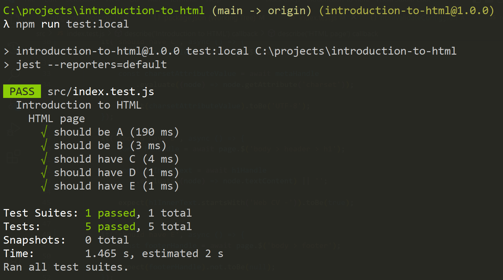
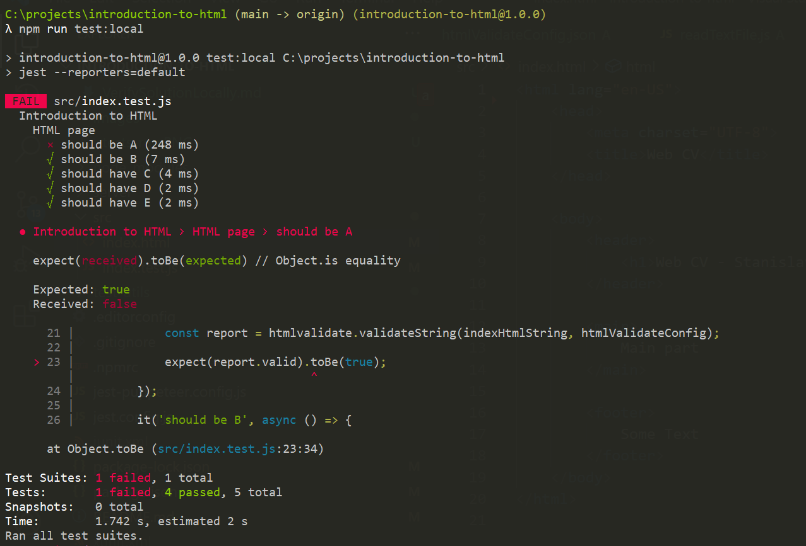

# Verify your solution

We use automatic test to verify tasks solutions. Be default, they are run every time you submit your solution. However, you can also run them locally.

Local tests verification is optional.

## Prerequisites

Install `NodeJS` and dependecies. Here are detailed instructions: [Setup NodeJS for tests and development](./SetupNodeJS.md).

## Running tests locally

If you have installed all the dependencies, you should be able to run tests.

Open the terminal (`command line, Bash, Git Bash`) in the **task root folder**. It is crucial opening it in this exact folder, or it will not work.

To run the command, type or copy it to the terminal and press `ENTER`.

**Commands for running tests**:

`npm run test:local` launches **a single run of all the tests we have for a task**.

`npm run test:watch` launches tests in a `"watch mode"`. In a `"watch mode"` tests are rerun every time you change the solution file (`index.html, index.js, styles.css` files).It might come in handy when fixing something in your solution. **This task "freezes" your terminal**. To stop it press `CTRL + C` on `Windows(Linux) OS` or `CMD + C` on `MacOS`.

## Tests results

Depending on your operating system, tests results may be displayed differently. However, they should look similar to the examples below:

#### When all tests pass

#### When some tests fail

