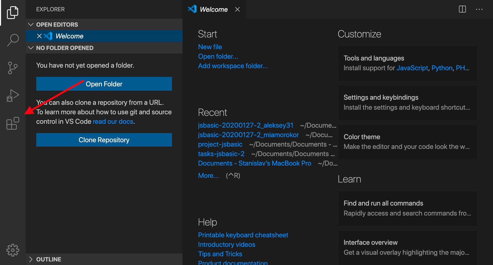
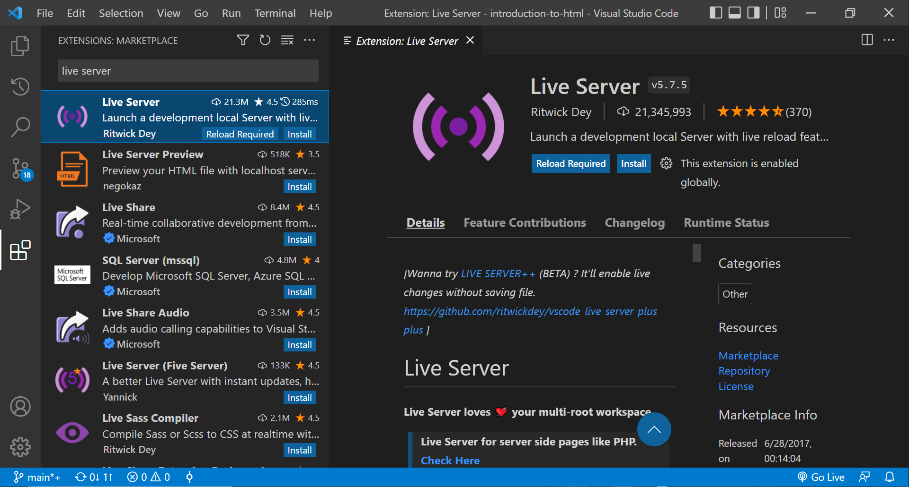

# Local Development

Usually, when working on an HTML page, you need a convenient development environment. By `development environment` we mean launching an `HTML` your page you're working on in your browser and updating it every time you change its content. 

Here are some options for doing this.

## Run with NodeJS in the terminal

## Prerequisites

Please install `NodeJS` and its dependecies. Here are detailed instructions: [Setup NodeJS for tests and development](./SetupNodeJS.md).

If you installed all the dependencies, you are good to go.

To launch a command, please, open the terminal (`command line, Bash, Git Bash`) in the **task root folder**. It is crucial to open it in this exact folder, or it will not work.

To run the command, type or copy it to the terminal and press `ENTER`.

**The command for launching your HTML page in the browser:**

`npm start` will open your `index.html` page with a solution in the browser window. Every time you change its content, it will refresh. It might come in handy when fixing something in your solution. **This task "freezes" your terminal**. To stop it in terminal, please, press `CTRL + C` on `Windows(Linux) OS` or `CMD + C` on `MacOS`.

## Run with VSCode live server plugin

`VSCode`(Visual Studio Code) is a modern editor we recommend using. It is free and powerful enough for most of the tasks you will face as a web developer.

You can download it here: [Install](https://code.visualstudio.com/).

The `VSCode` editor's features can be extended using plugins. A `plugin` is an add-on to the functionality. To launch `HTML` files in the browser, use the `Live Server` plugin. It must be installed to the `VSCode`.

### Install the Live Server plugin

1. Open the `VSCode` editor.
2. Select the `Extensions` tab on the left side of the menu, as shown in the picture.

3. In the search field at the top, type `Live Server`.

You should see something like this:

4. The first item in the list should be the `Live Server` plugin, click on it.
5. A detailed description will appear on the right. Click on the `Install` button and you're done :).

After successfully installing the plugin, open any `HTML` file, and right-click on it, or inside it. In the drop down menu, you will see the option `Open with Live Server`. When you select it, the `HTML` file will open in the browser. Now, every time you change something in this file content, the plugin would automatically reload the page in the browser.

In addition to launching through the context menu, it is possible to launch `Live Server` using special key combinations, they are different for different operating systems:
- `Windows`: `alt+L, alt+O` - start the server (`O` is a letter), `alt+L, alt+C` - stop the server;
- `MAC`: `cmd+L, cmd+O` - start the server (`O` is a letter), `cmd+L, cmd+C` - stop the server;

Please note that any `HTML` file could be launched this way.

**(!!!) IMPORTANT:** When working in practical tasks, you must open the root task folder in `VSCode` root task folder, for `Live Server` to work properly.
